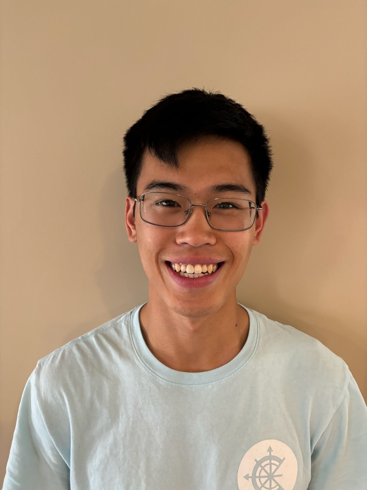

:::: {.columns}

::: {.column width="70%"}

Hi there! I'm an Astronomy Ph.D. student at the University of Virginia studying supermassive black holes and galaxies in cosmological simulations. 
When I'm not thinking about Astronomy, I enjoy playing games (board and video!), reading, swing dancing, and cooking and eating yummy (especially Asian) foods.
Feel free to take a look at what I've been up to lately!

:::

::: {.column width="30%"}

{.headshot fig-alt="Jonathan Kho"}

:::

::::
